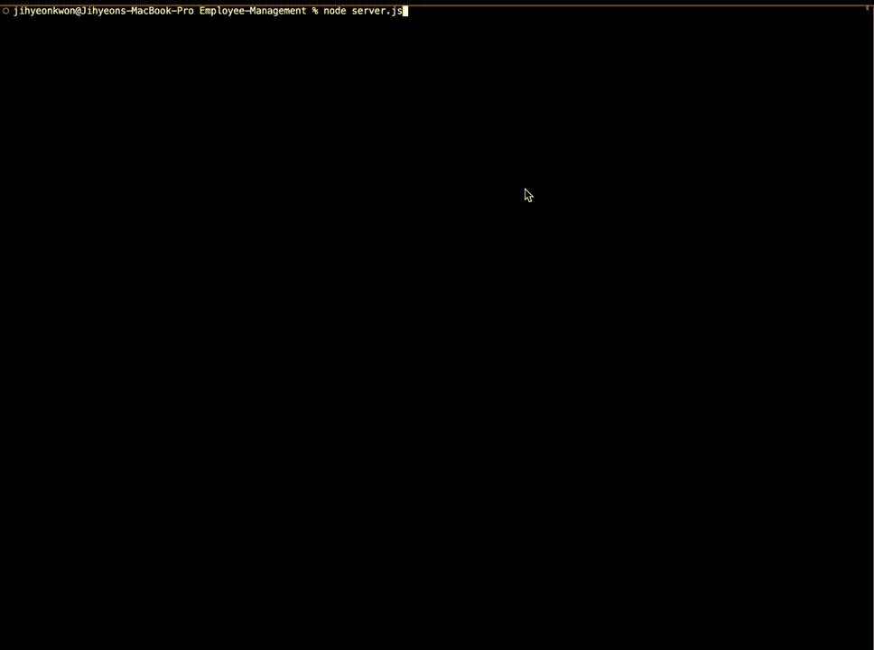

# Employee-Management

## Description
Employee-Management application is a command-line application that is designed to manage a company's employee database including their id, name, jop title, salary, manager, and department. The application allows users to view the employees information database and modify them by selecting a choice from a user prompt. Users can exit out of the application by selecting "Quit", and all of the modifications will be saved in the database.  


## Table of Contents
- [Installation](#installation)
- [Usage](#usage)
- [Features](#features)
- [Technologies-Used](#technologies-used)
- [Contribution](#contribution)
- [Preview](#preview)
- [Link](#link)

## Installation 
To install necessary dependencies, run following command:
```
npm i

```

## Usage
1. start the application by running :
```
node server.js
```
2. Select the desire function by choosing one of the options.
3. Follow the prompts to complete the chosen action.
4. To exit from the main menu, select "Quit".


## Features

## View Employee information database
### User Story
As a user,
I WANT to be able to view the employee database 
So That I can easily keep track of the employees' information 

### Accepted Criteria
- When I select "View all Employees"
- Then I am presented with the table with all the employees'  id, first name, last name, title, department, salary, and thier manager.
- When I select "View All Roles"
- Then I am presented with the table with all the roles in the company with their id, title, department, and salary. 
- When I select "View All Departments"
- Then I am presented with the table with all the departments in the company with their id and name.


## Add a new data
### User Story
As a user, 
I Want to be able to add a certain data records
So That the data of newly established department, newly hired employee, and transferred employee is updated with the lastest information.


### Accepted Criteria
- When I select "Add employee"
- Then I am prompted to enter their name, role, and manager
- When I have completed the prompted question
- Then the employee table in the database has a new employee with the informations I entered.
- When I select "Add Role"
- Then I am prompted to enter its name and department 
- When I have completed the prompted question
- Then the role table in the databse has a new role with the informations I entered
- When I select "Add Department"
- Then I am prmopted to enter its name 
- When I have completed the prompted question
- Then the department table in the database has a new department 


## Technologies-Used
- JavaScript
- Node.js
- inquirer
- cli-table 
- mysql


## Contribution 
1. Fork the Repo 
2. Create a new branch 
3. Make your contributions/changes 
4. push to the forked repo 
5. create a new pull request


## Preview 

This is the preview of the application 


## Link

This is the link to the application
[alt preview]()